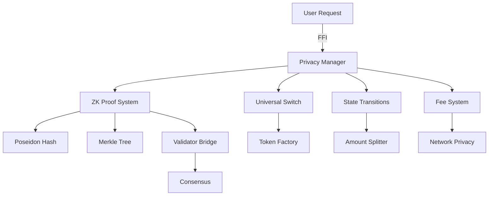

# QoraNet Privacy Module - Complete Architecture Documentation

## 🏗️ Module Overview

The QoraNet privacy module implements a comprehensive zero-knowledge privacy system using Halo2, enabling private transactions while maintaining blockchain transparency and security.

## 📊 Complete Architecture Map with All Files & Roles

```
┌─────────────────────────────────────────────────────────────────────────┐
│                    QoraNet Privacy Module Architecture                   │
├─────────────────────────────────────────────────────────────────────────┤
│                                                                          │
│ LAYER 1: ZK PROOF LAYER                                                 │
│ ┌────────────────────────────────────────────────────────────────────┐ │
│ │  ┌─────────────────────┐    ┌──────────────────────┐               │ │
│ │  │  ZK Proof System     │◄──►│  Halo2 Circuits ⚡   │               │ │
│ │  │  (zk_proofs.rs)      │    │ (halo2_circuits.rs)  │               │ │
│ │  │                      │    │                      │               │ │
│ │  │ Role: Main proof     │    │ Role: BN256 circuit  │               │ │
│ │  │ orchestration        │    │ implementation       │               │ │
│ │  └─────────────────────┘    └──────────────────────┘               │ │
│ └────────────────────────────────────────────────────────────────────┘ │
│                                                                          │
│ LAYER 2: CRYPTOGRAPHIC LAYER                                            │
│ ┌────────────────────────────────────────────────────────────────────┐ │
│ │  ┌─────────────────────┐    ┌──────────────────────┐               │ │
│ │  │  Poseidon Hash      │◄──►│   Merkle Tree        │               │ │
│ │  │  (poseidon.rs)      │    │  (merkle_tree.rs)    │               │ │
│ │  │                      │    │                      │               │ │
│ │  │ Role: Commitment &   │    │ Role: Tree ops &     │               │ │
│ │  │ nullifier generation │    │ proof paths          │               │ │
│ │  └─────────────────────┘    └──────────────────────┘               │ │
│ └────────────────────────────────────────────────────────────────────┘ │
│                                                                          │
│ LAYER 3: CORE PRIVACY MANAGEMENT                                        │
│ ┌────────────────────────────────────────────────────────────────────┐ │
│ │              Privacy Core (privacy.rs)                             │ │
│ │              Role: Central coordinator for all privacy operations   │ │
│ │              • Merkle tree management • Nullifier tracking          │ │
│ │              • WAL recovery • Atomic operations                     │ │
│ └────────────────────────────────────────────────────────────────────┘ │
│                                                                          │
│ LAYER 4: FEATURE MODULES                                                │
│ ┌────────────────────────────────────────────────────────────────────┐ │
│ │ ┌─────────────────┐ ┌────────────────┐ ┌────────────────┐         │ │
│ │ │Universal Switch │ │ Token Factory  │ │ State Manager  │         │ │
│ │ │(universal_sw..) │ │(token_factory) │ │  (state.rs)    │         │ │
│ │ │Role: Mode swap  │ │Role: Token gen │ │Role: Global st │         │ │
│ │ └─────────────────┘ └────────────────┘ └────────────────┘         │ │
│ │                                                                      │ │
│ │ ┌─────────────────┐ ┌────────────────┐ ┌────────────────┐         │ │
│ │ │State Transition│ │Amount Splitter │ │  Fee System    │         │ │
│ │ │(state_trans..) │ │(amount_split..)│ │ (fees_usd.rs)  │         │ │
│ │ │Role: TX states │ │Role: Note mgmt │ │Role: USD fees  │         │ │
│ │ └─────────────────┘ └────────────────┘ └────────────────┘         │ │
│ │                                                                      │ │
│ │ ┌─────────────────┐ ┌────────────────┐ ┌────────────────┐         │ │
│ │ │Network Privacy │ │Secure Privacy  │ │Validator Bridge│         │ │
│ │ │(network_priv..)│ │(secure_priv..) │ │(validator_br..)│         │ │
│ │ │Role: Net layer │ │Role: Security  │ │Role: Consensus │         │ │
│ │ └─────────────────┘ └────────────────┘ └────────────────┘         │ │
│ │                                                                      │ │
│ │ ┌────────────────────────────────────────────────────────┐         │ │
│ │ │          Transaction V2 (transaction_v2.rs)           │         │ │
│ │ │          Role: Enhanced transaction format             │         │ │
│ │ └────────────────────────────────────────────────────────┘         │ │
│ └────────────────────────────────────────────────────────────────────┘ │
│                                                                          │
│ LAYER 5: BLOCKCHAIN INTEGRATION                                         │
│ ┌────────────────────────────────────────────────────────────────────┐ │
│ │     Blockchain State Connector (blockchain/state_connector.rs)     │ │
│ │     Role: Bridge between privacy module and main blockchain        │ │
│ └────────────────────────────────────────────────────────────────────┘ │
│                                                                          │
│ LAYER 6: EXTERNAL INTERFACE (FFI)                                       │
│ ┌────────────────────────────────────────────────────────────────────┐ │
│ │  ┌────────────────────┐        ┌─────────────────────────┐        │ │
│ │  │     ffi.rs         │        │ ffi_universal_switch.rs │        │ │
│ │  │ Role: Main FFI     │        │ Role: Switch FFI        │        │ │
│ │  └────────────────────┘        └─────────────────────────┘        │ │
│ └────────────────────────────────────────────────────────────────────┘ │
│                                                                          │
│ LAYER 7: TESTING & EXAMPLES                                             │
│ ┌────────────────────────────────────────────────────────────────────┐ │
│ │  examples/test_scalar_methods.rs  │ test_scalar_random.rs          │ │
│ │  examples/test_security_fix.rs    │ Role: Test coverage            │ │
│ └────────────────────────────────────────────────────────────────────┘ │
│                                                                          │
│ MODULE ENTRY: mod.rs - Declares all modules & re-exports public API     │
└─────────────────────────────────────────────────────────────────────────┘
```

### 🔗 Key Module Connections:

```
zk_proofs.rs ←→ halo2_circuits.rs: Circuit implementation
     ↓                    ↓
poseidon.rs  ←→  merkle_tree.rs: Cryptographic operations
     ↓                    ↓
         privacy.rs: Core coordination
              ↓
    All feature modules connect here
              ↓
         FFI Layer: External access
```

## 📁 Complete File Structure & Responsibilities

### Core Components

#### 1. **mod.rs** - Module Declaration & Re-exports
```rust
// Module organization and entry point
- Declares all submodules in the privacy module
- Re-exports commonly used types (PrivacyPool, PrivacyStateManager, etc.)
- Provides clean API surface for external modules
```

#### 2. **zk_proofs.rs** - Zero-Knowledge Proof Engine
```rust
// Main Components:
- ZkProofSystem         // Main proof system using Halo2
- TransferCircuit       // Circuit for private transfers
- CircuitParams         // Configuration parameters
- ProofType            // Different proof types (Transfer, Deposit, Withdrawal, etc.)
```

**Key Features:**
- ✅ **No Trusted Setup Required** - Uses Halo2's transparent setup
- ✅ **KZG Commitment Scheme** - Efficient polynomial commitments
- ✅ **PLONK Arithmetization** - Advanced constraint system
- ✅ **Blake2b Transcripts** - Secure Fiat-Shamir transformation

**Circuit Implementation:**
```
TransferCircuit synthesize():
1. Load private inputs (secret, amount, blinding)
2. Compute commitment = Poseidon(secret, amount, blinding)
3. Verify Merkle proof (path validation)
4. Compute nullifier = Poseidon(secret, leaf_index)
5. Constrain public inputs (merkle_root, nullifier_hash)
```

#### 3. **halo2_circuits.rs** - BN256 Circuit Implementation ⚡
```rust
// BN256-optimized Halo2 circuits for EVM compatibility
- PrivacyChip           // Circuit chip with constraints
- PrivateTransferCircuit // Main transfer circuit
- Halo2ProofSystem      // BN256 proof system wrapper
- PrivacyConfig         // Circuit configuration
```

**Key Features:**
- ✅ **BN256 Curve** - EVM-compatible elliptic curve
- ✅ **Optimized Gates** - Addition, multiplication, Poseidon S-box
- ✅ **KZG Commitments** - Using ParamsKZG<Bn256>
- ✅ **Integration Ready** - create_switch_proof() for UniversalSwitch

#### 4. **poseidon.rs** - Cryptographic Hash Function
```rust
// Halo2-native Poseidon implementation
- Poseidon struct       // Main hasher
- hash2()              // Hash two elements
- hash_n()             // Hash multiple elements
- Helper functions     // Fr/H256 conversions
```

**Features:**
- Optimized for BN256 curve
- Constant-length hashing
- Recursive pair hashing for variable length inputs

#### 5. **privacy.rs** - Privacy State Management
```rust
// Core privacy infrastructure
- PrivacyMerkleTree    // Commitment tree structure
- PrivacyConfig        // Configuration settings
- PrivacyPool          // Privacy pool management
- PrivacyStateManager  // Global state coordinator
```

**Key Responsibilities:**
- Merkle tree management (height 32 default)
- Nullifier tracking and double-spend prevention
- WAL (Write-Ahead Log) for crash recovery
- Persistent storage management

#### 6. **universal_switch.rs** - Public/Private Mode Switching
```rust
// Dual-mode transaction system
- UniversalSwitch      // Main switch controller
- SwitchConfig         // Configuration
- switch_to_private()  // Convert public → private
- switch_to_public()   // Convert private → public
```

**Features:**
- Seamless mode switching
- Fee calculation (USD-based)
- State transition validation
- Cross-mode compatibility

#### 7. **token_factory.rs** - Token Creation System
```rust
// Protocol-level token creation
- TokenFactory         // Factory controller
- TokenMetadata        // Token information
- create_token()       // Deploy new token
- Dual-mode support    // Every token has both modes
```

**Capabilities:**
- Native dual-mode tokens
- Automatic privacy support
- USD-based creation fees
- Symbol registry

### Supporting Modules

#### 8. **merkle_tree.rs** - Merkle Tree Operations
```rust
// Sparse Merkle tree implementation
- insert_leaf()        // Add commitment
- get_path()          // Generate Merkle proof
- verify_path()       // Validate proof
- compute_root()      // Calculate root hash
```

#### 9. **state.rs** - Global State Management
```rust
// Centralized state coordination
- GlobalState struct    // Main state container
- StateSnapshot        // Point-in-time state capture
- StateManager         // State lifecycle management
```

#### 10. **state_transitions.rs** - State Machine
```rust
// Transaction state management
- StateTransition enum // State definitions
- validate_transition() // Transition rules
- apply_transition()   // State updates
```

#### 11. **amount_splitter.rs** - Amount Management
```rust
// Privacy-preserving amount splitting
- split_amount()       // Split into smaller notes
- combine_amounts()    // Merge notes
- optimize_splits()    // Minimize transaction size
```

#### 12. **fees_usd.rs** - Fee System
```rust
// USD-based fee calculation
- USDFeeSystem         // Fee controller
- calculate_fee()      // Dynamic fee calculation
- TransactionFeeType   // Fee categories
```

#### 13. **network_privacy.rs** - Network Layer Privacy
```rust
// Network-level privacy features
- Onion routing support
- Peer mixing
- Transaction broadcasting privacy
```

#### 14. **secure_privacy.rs** - Security Layer
```rust
// Additional security measures
- Key derivation
- Secure random generation
- Side-channel protection
```

#### 15. **validator_bridge.rs** - Consensus Integration
```rust
// Validator network integration
- Proof validation hooks
- Consensus participation
- Block inclusion rules
```

#### 16. **transaction_v2.rs** - Transaction Types V2
```rust
// Enhanced transaction format
- TokenId              // Unique token identifier
- TokenMode            // Public/Private mode enum
- TransactionV2        // New transaction structure
- Enhanced validation  // Improved security checks
```

### FFI Integration

#### 17. **ffi.rs** - Foreign Function Interface
```rust
// C/JavaScript bindings
- init_privacy_pool()
- generate_proof()
- verify_proof()
- process_transaction()
```

#### 18. **ffi_universal_switch.rs** - Switch FFI
```rust
// Universal switch FFI bindings
- ffi_switch_to_private()
- ffi_switch_to_public()
- ffi_get_switch_fee()
```

### Blockchain Integration

#### 19. **blockchain/state_connector.rs** - Blockchain State Bridge
```rust
// Connects privacy module to main blockchain
- StateConnector       // Main connector class
- PrivacyContract     // Contract information
- StateCache          // Performance optimization
- Event listeners     // Blockchain event handling
```

### Test Examples

#### 20. **examples/test_scalar_methods.rs** - Scalar Method Tests
```rust
// Test cases for scalar field operations
- Field arithmetic tests
- Conversion tests
- Edge case handling
```

#### 21. **examples/test_scalar_random.rs** - Random Scalar Tests
```rust
// Random scalar generation testing
- Randomness quality tests
- Distribution tests
- Security validation
```

#### 22. **examples/test_security_fix.rs** - Security Fix Tests
```rust
// Security vulnerability tests and fixes
- Known attack vectors
- Mitigation strategies
- Regression tests
```

## 🔄 Data Flow & Interactions

### Transaction Flow
```
1. User initiates private transaction
   ↓
2. Generate commitment = Poseidon(secret, amount, blinding)
   ↓
3. Add commitment to Merkle tree
   ↓
4. Generate ZK proof using Halo2 circuit
   ↓
5. Submit proof + nullifier to network
   ↓
6. Validators verify proof
   ↓
7. Update global state (add nullifier, update tree)
```

### Module Interactions



## 🔐 Security Architecture

### 1. **Cryptographic Security**
- **Halo2 ZK-SNARKs**: No trusted setup required
- **Poseidon Hash**: Optimized for ZK circuits
- **BN256 Curve**: 128-bit security level
- **KZG Commitments**: Polynomial commitment scheme

### 2. **Double-Spend Prevention**
```rust
// Nullifier-based prevention
nullifier = Poseidon(secret, leaf_index)
// Each nullifier can only be used once
```

### 3. **Privacy Guarantees**
- **Sender Privacy**: Hidden in anonymity set
- **Amount Privacy**: Committed values hidden
- **Recipient Privacy**: Stealth addresses

### 4. **State Integrity**
- **WAL Recovery**: Atomic operations
- **Merkle Root Verification**: Consensus validation
- **Persistent Storage**: Crash-resistant

## 🚀 Performance Optimizations

### 1. **Proof Generation**
- Pre-computed proving keys
- Parallel witness generation
- Optimized field operations

### 2. **Storage**
- Sparse Merkle trees
- Compressed nullifier storage
- Incremental snapshots

### 3. **Network**
- Batch proof verification
- Compressed proof transmission
- Cached verification results

## 📈 Scalability Features

### 1. **Horizontal Scaling**
- Sharded Merkle trees
- Distributed proof generation
- Parallel verification

### 2. **Vertical Scaling**
- Configurable tree height
- Adjustable circuit complexity
- Dynamic batching

## 🧪 Testing Infrastructure

### Test Coverage
```
tests/
├── integration_tests.rs  // End-to-end tests
├── circuit_tests.rs      // Circuit correctness
├── merkle_tests.rs       // Tree operations
└── performance_tests.rs  // Benchmarks
```

## 🔧 Configuration

### Default Settings
```rust
PrivacyConfig {
    tree_height: 32,           // 2^32 leaves
    nullifier_db_path: "./data/nullifiers",
    wal_path: "./data/wal",
    max_proof_size: 320,       // bytes
    circuit_k: 11,             // 2^11 rows
}
```

## 📊 Performance Metrics

| Operation | Time | Memory | Description |
|-----------|------|--------|-------------|
| Proof Generation | ~2s | 512MB | Single transfer proof |
| Proof Verification | ~20ms | 64MB | Single proof verify |
| Commitment Generation | ~1ms | 1KB | Poseidon hash |
| Merkle Path Generation | ~10ms | 32KB | 32-height tree |
| Nullifier Check | ~1ms | - | HashSet lookup |

## 🛠️ Usage Examples

### Generate Private Transfer
```rust
// Create witness
let witness = PrivateWitness {
    secret: H256::random(),
    amount: U256::from(100),
    blinding: H256::random(),
    merkle_path: tree.get_path(leaf_index),
    leaf_index,
};

// Generate proof
let proof = zk_system.prove_transfer(&witness, &public_inputs)?;

// Verify proof
let valid = zk_system.verify(&proof)?;
```

### Switch to Private Mode
```rust
let switch = UniversalSwitch::new(config);
let result = switch.switch_to_private(
    token_id,
    amount,
    recipient,
)?;
```

## 🔮 Future Enhancements

1. **Recursive Proofs** - Proof aggregation
2. **Multi-Asset Support** - Multiple token types
3. **Cross-Chain Privacy** - Bridge integration
4. **Hardware Acceleration** - GPU/FPGA support
5. **Privacy Pools** - Compliance-friendly privacy

## 📝 Dependencies

- `halo2_proofs`: Core proof system
- `halo2_gadgets`: Poseidon implementation
- `halo2curves`: BN256 curve operations
- `ethereum_types`: H256/U256 types
- `ff`: Field operations
- `blake2b_simd`: Transcript hashing

## 🤝 Contributing

The privacy module is designed for extensibility. Key extension points:
- Custom proof types in `ProofType` enum
- Additional circuits in `halo2_circuits.rs`
- New hash functions alongside Poseidon
- Alternative commitment schemes

## 📄 License

Part of QoraNet blockchain - see main repository for license details.
